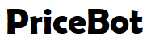

<div id="top"></div>
<!--
*** Comment Section
-->

[![LinkedIn][linkedin-shield]][linkedin-url]

<!-- PROJECT LOGO -->
<br />
<div align="center">
  <a href="https://github.com/github_username/repo_name">
    
  </a>
</div>


<!-- TABLE OF CONTENTS -->
<details>
  <summary>Table of Contents</summary>
  <ol>
    <li>
      <a href="#about-the-project">About The Project</a>
      <ul>
        <li><a href="#built-with">Built With</a></li>
      </ul>
    </li>
    <li>
      <a href="#getting-started">Getting Started</a>
      <ul>
        <li><a href="#parameters">Parameters</a></li>
        <li><a href="#installation">Installation</a></li>
      </ul>
    </li>
    <li><a href="#roadmap">Roadmap</a></li>
    <li><a href="#license">License</a></li>
    <li><a href="#contact">Contact</a></li>
    <li><a href="#acknowledgments">Acknowledgments</a></li>
  </ol>
</details>


<!-- ABOUT THE PROJECT -->
## About The Project

[![Product Name Screen Shot][product-screenshot]](https://example.com)

*WORK IN PROGRESS* Bot which allows you to track price and stock availability of the desired product.
1. Search product on Amazon
2. Apply filter to narrow down the results
3. Copy URL
4. Get notification by email about new products regarding your search
5. Be happy to be the first one to get the product

<p align="right">(<a href="#top">back to top</a>)</p>


### Built With

* [Python](https://www.python.org/)
* [Beautiful Soup](https://beautiful-soup-4.readthedocs.io/en/latest/)
* [requests](https://docs.python-requests.org/en/latest/)

<p align="right">(<a href="#top">back to top</a>)</p>


<!-- GETTING STARTED -->
## Getting Started

all settings can be adjusted in config.json
password for sender email adress has to be saved in password.txt file (Do not share this file with anyone!)

### Parameters

* "notification_mode"
  ```sh
  #TODO "decrease_of_prodcts":
  #TODO "increase_of_prodcts": 
  #TODO "decrease_num_of_items": 
  #TODO"increase_num_of_items": 
  #TODO "decrease_price":
  #TODO "increase_price": 
  "ignore_price_above_eur": ignore any changes for products above x euro
  #TODO"ignore_price_below_eur":
  #TODO "cooldown_for_change_notification_sec" seconds to cool down after one email (the higher the less (possible spam) mails you will receive (sometimes a high fluctuation occurs))
  ```

    

### Installation

1. save password from sender email in password.txt
2. Get URL from desired product on amazon
3. Adjust parameter in config.json
4. Run mac_watcher.py

<p align="right">(<a href="#top">back to top</a>)</p>

<!-- ROADMAP -->
## Roadmap

- [ ] Multiple notification channels
- [ ] Automatically buy product
    - [ ] check certain price range

See the [open issues](https://github.com/github_username/repo_name/issues) for a full list of proposed features (and known issues).

<p align="right">(<a href="#top">back to top</a>)</p>

<p align="right">(<a href="#top">back to top</a>)</p>

<!-- CONTACT -->
## Contact

Project Link: [https://github.com/github_username/repo_name](https://github.com/JoshAlb21/PriceBot.git)

<p align="right">(<a href="#top">back to top</a>)</p>

<!-- MARKDOWN LINKS & IMAGES -->
<!-- https://www.markdownguide.org/basic-syntax/#reference-style-links -->
[contributors-shield]: https://img.shields.io/github/contributors/github_username/repo_name.svg?style=for-the-badge
[contributors-url]: https://github.com/github_username/repo_name/graphs/contributors
[forks-shield]: https://img.shields.io/github/forks/github_username/repo_name.svg?style=for-the-badge
[forks-url]: https://github.com/github_username/repo_name/network/members
[stars-shield]: https://img.shields.io/github/stars/github_username/repo_name.svg?style=for-the-badge
[stars-url]: https://github.com/github_username/repo_name/stargazers
[issues-shield]: https://img.shields.io/github/issues/github_username/repo_name.svg?style=for-the-badge
[issues-url]: https://github.com/github_username/repo_name/issues
[license-shield]: https://img.shields.io/github/license/github_username/repo_name.svg?style=for-the-badge
[license-url]: https://github.com/github_username/repo_name/blob/master/LICENSE.txt
[linkedin-shield]: https://img.shields.io/badge/-LinkedIn-black.svg?style=for-the-badge&logo=linkedin&colorB=555
[linkedin-url]: https://www.linkedin.com/in/joshua-albiez-7a9a941a8/
[product-screenshot]: images/Price_Bot.png